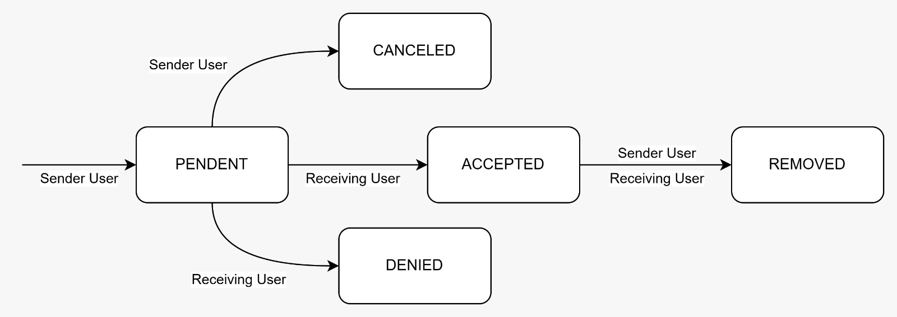

# Concord Chat - Back-end (WIP)

**Current Version**: `0.1.0-beta (open to public testing)`  </br>
**PT-BR README**: [Clique aqui para ver em Português](./README-PTBR.md) </br></br>
**GitHub Projects (Back-end)**: [Back-end Project Board](https://github.com/users/marcusnogueiraa/projects/2) </br>
**Front-end Repository**: [Concord Chat Front-end](http://github.com/mmiiranda/concord)  </br>
**Project Deploy**: [Front-end Live Demo](http://164.68.101.141:8081/)  </br>

---

## Table of Contents
1. [Collaborators](#collaborators)  
2. [Development Workflow & Best Practices](#development-workflow--best-practices)  
3. [Technologies & Dependencies](#technologies--dependencies)  
   - [Core Technologies](#core-technologies)  
   - [Spring Framework & Related Libraries](#spring-framework--related-libraries)  
   - [Testing Stack](#testing-stack)  
4. [Current Features](#current-features)  
   - [Authentication & Security](#authentication--security)  
   - [File Handling](#file-handling)  
   - [Friendship System & Real-time Notifications](#friendship-system--real-time-notifications)  
   - [Logging](#logging)  
   - [Aspect-Oriented Programming (AOP)](#aspect-oriented-programming-aop)  
   - [Documentation](#documentation)  
   - [Message History Storage](#message-history-storage)  
   - [Real-time Text Messaging](#real-time-text-messaging)  
   - [WebSockets Architecture](#websockets-architecture)  
   - [Friendship States & State Machine](#friendship-states--state-machine)  
   - [Unit Tests & Quality Gates](#unit-tests--quality-gates)  
   - [Redis for Horizontal Scaling](#redis-for-horizontal-scaling)  
   - [Project Architecture & Design Patterns](#project-architecture--design-patterns)  
   - [Docker Compose & Deployment](#docker-compose--deployment)  
5. [Work in Progress (WIP)](#work-in-progress-wip)  
6. [Fun Fact](#fun-fact)
7. [Project Structure](#project-structure)  
8. [How to Run](#how-to-run)  
   - [Windows](#windows)  
   - [Linux](#linux)  
9. [Contact & Feedback](#contact--feedback)  
10. [License Recommendation](#license-recommendation)  

---

## Collaborators

Below are the main collaborators working on the project (in alphabetical order). Click a card to visit their GitHub profiles:

<table>
  <tr>
    <td align="center">
      <a href="https://github.com/marcusnogueiraa">
        
        <br /><sub><b>Marcus Nogueira</b></sub>
      </a>
    </td>
    <td align="center">
      <a href="https://github.com/mmiiranda">
        
        <br /><sub><b>Mauricio Miranda</b></sub>
      </a>
    </td>
    <td align="center">
      <a href="https://github.com/sheiely">
        
        <br /><sub><b>Sheiely Nascimento</b></sub>
      </a>
    </td>
  </tr>
</table>

---

## Development Workflow & Best Practices

- **GitFlow**: We follow the [GitFlow model](https://nvie.com/posts/a-successful-git-branching-model/) which includes `release`, `hotfix`, `feature`, and `develop` branches to organize our development.
- **Kanban for Process Management**: Our tasks and issues are visualized and tracked using a [Kanban system](https://www.atlassian.com/agile/kanban), ensuring a continuous flow of work and quick adaptability.
- **Conventional Commits**: We adopt [Conventional Commits](https://www.conventionalcommits.org/en/v1.0.0/) for clearer commit messages and automatic versioning.
- **Code Review & Pair Programming**: All pull requests are reviewed to maintain quality; we occasionally practice [Pair Programming](https://www.geeksforgeeks.org/pair-programming/) to enhance collaboration and knowledge sharing.

---

## Technologies & Dependencies

### Core Technologies
- **Java 17**: Main programming language, ensuring modern features and performance.
- **Spring Boot**: Rapid application development framework for production-ready apps.
- **Gradle**: Build automation tool, used to manage dependencies and tasks.
- **PostgreSQL**: Relational database for structured data and transactions.
- **Redis**: In-memory data store for distributed caching and facilitating horizontal scaling.
- **MongoDB**: NoSQL database for efficient and flexible storage of large volumes of messages.

### Spring Framework & Related Libraries

1. **Spring Security**  
   Provides authentication, authorization, and security features (integrated with JWT for token-based auth).

2. **Spring Data Redis**  
   Manages Redis integration, used for caching, messaging, and maintaining state across multiple instances of the application.

3. **Spring Data JPA**  
   Offers powerful abstractions for database access (used with PostgreSQL via Hibernate).

4. **Spring Mongo**  
   Simplifies interactions with MongoDB for storing chat histories and other big-data-like structures.

5. **Spring DevTools**  
   Enhances developer experience with automatic reloads and faster feedback loops.

6. **Spring AOP**  
   Enables Aspect-Oriented Programming, allowing us to abstract cross-cutting concerns (like logging).

7. **Spring WebSockets**  
   Provides low-level WebSocket support; we're building our own WebSocket event system on top of it.

8. **Spring Mail**  
   Handles email sending, crucial for account verification and password reset flows.

9. **Hibernate**  
   An Object-Relational Mapping (ORM) tool, used under the hood with JPA for PostgreSQL entities.

10. **SLF4J (Simple Logging Facade for Java)**  
    Uniform logging interface used across the app, with multiple logging bindings.

11. **Logback**  
    Logging framework (used with SLF4J) for advanced log configuration, output to console and file.

12. **Swagger**  
    Generates interactive API documentation, making it easier to explore and test endpoints.

13. **Lombok**  
    Reduces boilerplate code for getters, setters, constructors, etc.

### Testing Stack

- **JUnit**  
  Standard testing framework for unit and integration tests.
- **Mockito**  
  Used for mocking dependencies in unit tests, ensuring isolation.
- **H2 Database**  
  Lightweight, in-memory relational database used for fast and isolated test environments.

---

## Current Features

### Authentication & Security
- **JWT-Based Authentication**: Uses tokens signed with **HMAC256**; user passwords are encrypted with **BCrypt**.
- **Email Verification**: Upon registration, an email is sent to verify account ownership.
- **Max Retry with IP Jail**: Prevents brute-force attacks by banning the offending IP for 15 minutes after repeated failed login attempts.
- **Password Recovery & Internal Change**: “Forgot my password” flow and the ability for users to update their password internally.

### File Handling
- **Manual Upload & Download Service**: Simplified approach for storing and retrieving user-uploaded files.

### Friendship System & Real-time Notifications
- Users can send friendship requests, accept/deny/cancel them, and remove friendships.
- **WebSockets** are used to deliver real-time notifications (e.g., a friend request event is pushed to the receiver instantly).

### Logging
- **SLF4J & Logback**: Logs are generated both in the terminal and in external log files, providing traceability and debugging information.

### Aspect-Oriented Programming (AOP)
- Cross-cutting concerns (like logging) are separated from business logic, making the codebase cleaner and more maintainable.
- [Learn more about AOP](https://docs.spring.io/spring-framework/docs/current/reference/html/core.html#aop)

### Documentation
- **Swagger**: Auto-generated API documentation accessible in a user-friendly web interface.

### Message History Storage
- **MongoDB** is used to store message data efficiently. Because messages can grow to very large volumes, a NoSQL solution like MongoDB is ideal for quick queries, indexing, and horizontal scaling.

### Real-time Text Messaging
- **WebSocket** connections ensure messages are delivered instantly.
- Offline messages are also stored so users can retrieve them once they reconnect.

### WebSockets Architecture
- Built **from scratch** without sub-protocols like STOMP. 
- We have an `EventType` enum:

  ```java
  public enum EventType {
      CONNECT,
      USER_MESSAGE,
      FRIEND_REQUEST,
      CHANNEL_MESSAGE,
      USER_STATUS
  }
  ```

- Incoming events are delegated to specific handlers (e.g., `UserMessageHandler`), while outgoing events are dispatched via a **Notification Service** for real-time updates.

### Friendship States & State Machine
- Friendships can be in the states: **pending**, **accepted**, **denied**, **canceled**, or **removed**.
- Rules:
  - Only the sender can *cancel* a pending request.
  - Only the receiver can *deny* or *accept* a pending request.
  - Both can *remove* an accepted friendship.
- The **Friendship Service** enforces these rules. (State machine diagram to be attached.)



### Unit Tests & Quality Gates
- **Mockito + JUnit + H2**: Our tests simulate real scenarios with an in-memory database.
- **No Broken Tests**: Pushing code with failing tests is **strictly prohibited**, maintaining high code reliability.

### Redis for Horizontal Scaling
- We plan to scale the application across multiple instances behind a load balancer.
- **Redis** is used for distributed cache and to synchronize state (like session data or user presence) between different application nodes.

### Project Architecture & Design Patterns
- **Layered Architecture**: Separates concerns by domain and flow (controllers, services, repositories, domain objects).
- **DTO & Mapper Patterns**: Isolate persistence from external representations, ensuring flexible, maintainable code.  

- **Aspect-Oriented Programming**: As previously mentioned, used to handle cross-cutting concerns.  
  [More on AOP](https://www.baeldung.com/spring-aop)

### Docker Compose & Deployment
- We use **Docker Compose** to spin up the entire environment (PostgreSQL, Redis, MongoDB, etc.) for integration and deployment tests.
- **Gradle bootRun** is used for local development with **DevTools** for hot reload.

---

## Work in Progress (WIP)

Some upcoming (or partially implemented) features:

- **Channels & Servers**  
  Introduce hierarchical structures like “Servers” and dedicated text/voice channels, similar to Discord.

- **File Sending**  
  Enhancements for in-chat file sharing with improved security checks.

- **Audio Recording**  
  Recording and possibly streaming audio channels in real-time.

- **Caching Optimization**  
  Identifying and adding strategic caches to reduce backend processing overhead.

- **Observability with Grafana**  
  Integrate metrics and logs with tools like Grafana for better insight into system performance.

- **End-to-End Testing (e2e)**  
  Comprehensive tests spanning front-end and back-end to ensure consistent user experience.

- **CI/CD Pipelines**  
  Automated build, test, and deploy pipelines for rapid and reliable deployments.

- **Voice Chat**  
  Real-time voice communication, including possible session management and latencies optimization.

---

## How to Run

> **Note**: Make sure you have **Java 17**, **Gradle**, and **Docker** installed.

### Linux and Windows

1. **Clone the repository**:
   ```bash
   git clone https://github.com/marcusnogueiraa/concord.git
   ```
2. **Build the project**:
   ```bash
   cd concord
   ./gradle build
   ```
3. **Start Docker services**:
   ```bash
   docker compose up
   ```
   This will spin up Spring Boot, PostgreSQL, Redis, and MongoDB containers (and any other dependencies).
   The back-end will start on the configured port (e.g., `8080`).

---

## Fun Fact

This project already contains over 5000 lines of code (and growing), reflecting the complexity and diverse set of features under development.

---

## Project Structure

Below is a simplified view of the main folders and files in the Concord Chat Back-end:
concord/src
```
├───main
│   ├───java
│   │   └───com
│   │       └───concord
│   │           └───concordapi
│   │               │   ConcordapiApplication.java
│   │               │   
│   │               ├───auth
│   │               │   ├───controller
│   │               │   │       AuthController.java
│   │               │   │       
│   │               │   ├───dto
│   │               │   │       ConfirmationCode.java
│   │               │   │       CreateUserDto.java
│   │               │   │       ForgotPasswordRequest.java
│   │               │   │       LoginUserDto.java
│   │               │   │       RecoveryJwtTokenDto.java
│   │               │   │       ResetPasswordRequest.java
│   │               │   │       ValidadeJwtTokenDto.java
│   │               │   │       
│   │               │   ├───entity
│   │               │   │       UserDetailsImpl.java
│   │               │   │       
│   │               │   ├───exception
│   │               │   │       IncorrectCodeException.java
│   │               │   │       IncorrectTokenException.java
│   │               │   │       MaxRetryException.java
│   │               │   │       UserAlreadyExistsException.java
│   │               │   │       
│   │               │   ├───filter
│   │               │   │       UserAuthenticationFilter.java
│   │               │   │       
│   │               │   └───service
│   │               │           AuthService.java
│   │               │           JwtTokenService.java
│   │               │           UserDetailsServiceImpl.java
│   │               │           
│   │               ├───channel
│   │               │   ├───controller
│   │               │   │       ChannelController.java
│   │               │   │       
│   │               │   ├───dto
│   │               │   │   ├───request
│   │               │   │   │       ChannelCreateBodyDto.java
│   │               │   │   │       ChannelPutBodyDto.java
│   │               │   │   │       
│   │               │   │   └───response
│   │               │   │           ChannelDto.java
│   │               │   │           
│   │               │   ├───entity
│   │               │   │       Channel.java
│   │               │   │       
│   │               │   ├───mapper
│   │               │   │       ChannelMapper.java
│   │               │   │       
│   │               │   ├───repository
│   │               │   │       ChannelRepository.java
│   │               │   │       
│   │               │   └───service
│   │               │           ChannelService.java
│   │               │           
│   │               ├───fileStorage
│   │               │   ├───controller
│   │               │   │       FileStorageController.java
│   │               │   │       
│   │               │   ├───dto
│   │               │   │       FileResponseDto.java
│   │               │   │       FileUploadResponseDto.java
│   │               │   │       
│   │               │   ├───entity
│   │               │   │       FilePrefix.java
│   │               │   │       FileType.java
│   │               │   │       
│   │               │   └───service
│   │               │           FileCleanupService.java
│   │               │           FileStorageService.java
│   │               │           
│   │               ├───friendship
│   │               │   ├───controller
│   │               │   │       FriendshipController.java
│   │               │   │       
│   │               │   ├───dto
│   │               │   │   ├───request
│   │               │   │   │       FriendshipCreateDTO.java
│   │               │   │   │       
│   │               │   │   └───response
│   │               │   │           FriendshipDto.java
│   │               │   │           
│   │               │   ├───entity
│   │               │   │       Friendship.java
│   │               │   │       FriendshipStatus.java
│   │               │   │       
│   │               │   ├───mapper
│   │               │   │       FriendshipMapper.java
│   │               │   │       
│   │               │   ├───repository
│   │               │   │       FriendshipRepository.java
│   │               │   │       
│   │               │   └───service
│   │               │           FriendshipService.java
│   │               │           
│   │               ├───logging
│   │               │   └───aspect
│   │               │           AuthLoggingAspect.java
│   │               │           ChannelLoggingAspect.java
│   │               │           FriendshipLoggingAspect.java
│   │               │           MessageLoggingAspect.java
│   │               │           ServerLoggingAspect.java
│   │               │           UserLoggingAspect.java
│   │               │           WebSocketLoggingAspect.java
│   │               │           
│   │               ├───messsage
│   │               │   ├───controller
│   │               │   │       UserMessageController.java
│   │               │   │       
│   │               │   ├───dto
│   │               │   │   ├───request
│   │               │   │   │       UserMessageRequestDto.java
│   │               │   │   │       
│   │               │   │   └───response
│   │               │   │           UserChatSummaryDto.java
│   │               │   │           UserMessageResponseDto.java
│   │               │   │           
│   │               │   ├───entity
│   │               │   │       UserChatSummary.java
│   │               │   │       UserMessage.java
│   │               │   │       
│   │               │   ├───repository
│   │               │   │       UserMessageRepository.java
│   │               │   │       
│   │               │   └───service
│   │               │           UserMessageService.java
│   │               │           
│   │               ├───server
│   │               │   ├───controller
│   │               │   │       ServerController.java
│   │               │   │       
│   │               │   ├───dto
│   │               │   │   ├───request
│   │               │   │   │       ServerCreateBodyDTO.java
│   │               │   │   │       ServerPutBodyDTO.java
│   │               │   │   │       
│   │               │   │   └───response
│   │               │   │           ServerDto.java
│   │               │   │           ServerSummaryDto.java
│   │               │   │           
│   │               │   ├───entity
│   │               │   │       Server.java
│   │               │   │       
│   │               │   ├───mapper
│   │               │   │       ServerMapper.java
│   │               │   │       
│   │               │   ├───repository
│   │               │   │       ServerRepository.java
│   │               │   │       
│   │               │   └───service
│   │               │           ServerService.java
│   │               │           
│   │               ├───shared
│   │               │   ├───config
│   │               │   │       AspectConfig.java
│   │               │   │       RedisConfig.java
│   │               │   │       SecurityConfiguration.java
│   │               │   │       WebConfig.java
│   │               │   │       
│   │               │   ├───dto
│   │               │   │       ErrorResponseDTO.java
│   │               │   │       
│   │               │   ├───exception
│   │               │   │       EmptyFileException.java
│   │               │   │       EntityNotFoundException.java
│   │               │   │       FailManipulationFriendship.java
│   │               │   │       FileFormatException.java
│   │               │   │       FileNotFoundException.java
│   │               │   │       FileStorageException.java
│   │               │   │       InternalServerErrorException.java
│   │               │   │       SMTPServerException.java
│   │               │   │       
│   │               │   ├───handler
│   │               │   │       GlobalExceptionHandler.java
│   │               │   │       
│   │               │   └───service
│   │               │           EmailService.java
│   │               │           RedisService.java
│   │               │           
│   │               ├───user
│   │               │   ├───controller
│   │               │   │       UserController.java
│   │               │   │       UserPreferenceController.java
│   │               │   │       
│   │               │   ├───dto
│   │               │   │   ├───request
│   │               │   │   │       UserPatchImage.java
│   │               │   │   │       UserPatchName.java
│   │               │   │   │       UserPatchUsername.java
│   │               │   │   │       UserPreferenceRequestDto.java
│   │               │   │   │       
│   │               │   │   └───response
│   │               │   │           UserDto.java
│   │               │   │           UserPreferenceDto.java
│   │               │   │           
│   │               │   ├───entity
│   │               │   │       User.java
│   │               │   │       UserPreference.java
│   │               │   │       
│   │               │   ├───mapper
│   │               │   │       UserMapper.java
│   │               │   │       UserPreferenceMapper.java
│   │               │   │       
│   │               │   ├───repository
│   │               │   │       UserPreferenceRepository.java
│   │               │   │       UserRepository.java
│   │               │   │       
│   │               │   └───service
│   │               │           UserPreferenceService.java
│   │               │           UserService.java
│   │               │           
│   │               └───websocket
│   │                   ├───config
│   │                   │       WebSocketConfig.java
│   │                   │       
│   │                   ├───entity
│   │                   │   │   ClientMessage.java
│   │                   │   │   EventType.java
│   │                   │   │   
│   │                   │   └───content
│   │                   │           ChannelMessageContent.java
│   │                   │           ConnectContent.java
│   │                   │           FriendRequestContent.java
│   │                   │           UserMessageContent.java
│   │                   │           
│   │                   ├───handler
│   │                   │       ChannelMessageHandler.java
│   │                   │       ConnectHandler.java
│   │                   │       EventHandler.java
│   │                   │       UserMessageHandler.java
│   │                   │       WebSocketHandler.java
│   │                   │       
│   │                   └───service
│   │                           NotificationService.java
│   │                           SessionService.java
│   │                           
│   └───resources
│           application.properties
│           logback.xml
│           
└───test
    └───java
        └───com
            └───concord
                └───concordapi
                    │   ConcordapiApplicationTests.java
                    │   
                    ├───auth
                    │   └───service
                    │           AuthServiceTest.java
                    │           
                    ├───channel
                    │   └───service
                    │           ChannelServiceTest.java
                    │           
                    ├───friendship
                    │   └───service
                    │           FriendshipServiceTest.java
                    │           
                    ├───server
                    │   └───service
                    │           ServerServiceTest.java
                    │           
                    ├───shared
                    │   ├───config
                    │   │       AppConfig.java
                    │   │       
                    │   ├───service
                    │   │       EmailServiceTest.java
                    │   │       
                    │   └───util
                    │           UtilsMethods.java
                    │           
                    └───user
                        └───service
                                UserServiceTest.java
```                                

---

## Contact & Feedback

- **Deployment Info**: Version `0.1.0-beta` is deployed on an Ubuntu 24.04 VPS for public tests.  
- **Feedback & Suggestions**: Please send your thoughts to [concord.chat@gmail.com](mailto:concord.chat@gmail.com).

---

## License

[MIT License](https://opensource.org/licenses/MIT) 

---


---  
*Thank you for checking out the Concord Chat Back-end! We look forward to your contributions and feedback.*